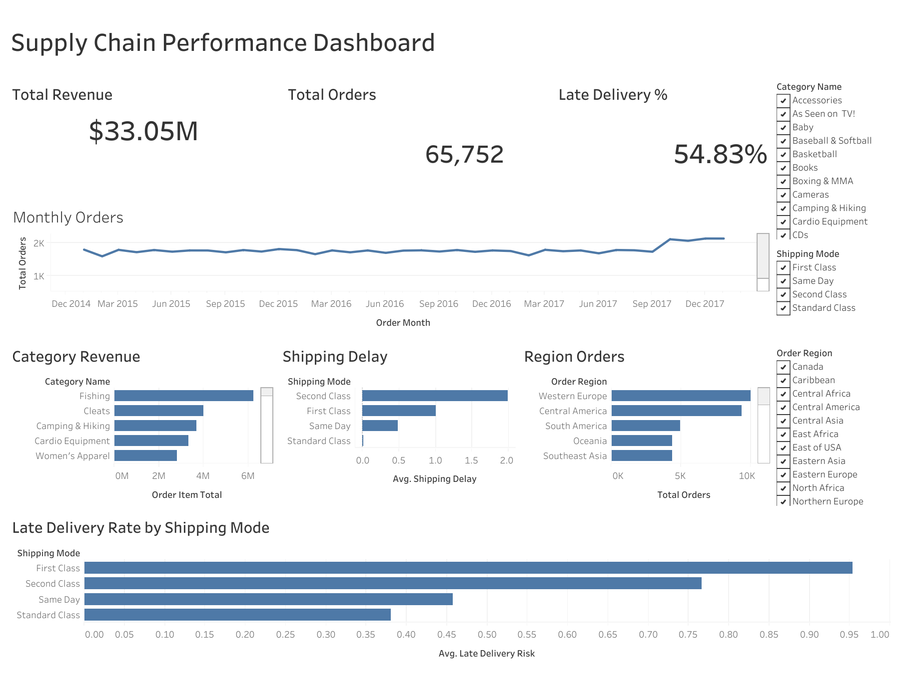

#  Supply Chain Analytics & Demand Forecasting

> **Data-driven insights for smarter logistics, inventory planning, and demand prediction.** — from raw CSV to SQL database, interactive BI dashboard, and a 90-day demand forecast — built to demonstrate an end-to-end analytics pipeline.

## Key Highlights

- Analyzed ~180K supply chain orders across 3 years  
- Identified 54% late delivery rate in Standard Class shipping  
- Discovered strong Q4 seasonality (2.3× demand spike)  
- Built forecasting model with 1.59% SMAPE  
- Developed interactive Tableau dashboard  

[](https://www.python.org/)
[](https://facebook.github.io/prophet/)
[](https://www.sqlite.org/)
[](https://public.tableau.com/app/profile/jahid.hasan3683/viz/Supply_Chain_Analytics_Dashboard/SupplyChainPerformanceDashboard)
[](notebooks/)
[](LICENSE)

---

## Overview

The goal is to improve delivery performance, optimize inventory planning, and support data-driven decision-making.

**Skills demonstrated:**
- End-to-end data pipeline (ingestion → cleaning → SQL → BI → ML)
- Time series forecasting with Facebook Prophet (SMAPE: 1.59%)
- Business intelligence dashboard in Tableau with interactive filters
- Analytical SQL for operational KPIs
- Python-based modular source code (`src/`)

---

## Dataset

| Property | Detail |
|---|---|
| **Source** | [DataCo Smart Supply Chain Dataset](https://data.mendeley.com/datasets/8gx2fvg2k6/5) — Mendeley Data |
| **File** | `data/raw/dataco_supply_chain.csv` |
| **Records** | ~180,000 orders |
| **Time range** | Jan 2015 – Jan 2018 (3 years) |
| **Key columns** | Order date, category, region, shipping mode, delivery status, sales, profit, days for shipping (real vs. scheduled) |
| **Processed format** | `.parquet` (via Pandas) for faster downstream loading |

---

## Business Problem

Modern supply chains face a range of compounding challenges:

| Challenge | Business Impact |
|---|---|
| Shipment delays | Customer dissatisfaction, SLA breaches |
| Inefficient shipping methods | Inflated operational costs |
| Uneven product demand | Stockouts or excess inventory |
| Regional logistics bottlenecks | Revenue loss in key markets |

---

## Interactive Dashboard

 **[View Live Tableau Dashboard →](https://public.tableau.com/app/profile/jahid.hasan3683/viz/Supply_Chain_Analytics_Dashboard/SupplyChainPerformanceDashboard)**




> *Open the link above to explore KPIs, trends, and regional breakdowns interactively.*

**Dashboard includes:**
- KPIs — Total Revenue, Total Orders, Late Delivery %
- Monthly demand trend (line chart)
- Category-wise revenue breakdown
- Regional order distribution map
- Shipping mode vs. late delivery rate analysis
- Interactive filters — Category, Shipping Mode, Region

---

## Demand Forecasting

A 90-day demand forecast was built using **Facebook Prophet**, with seasonality components tuned to the dataset's weekly and annual patterns.

### Model Performance

| Metric | Value | Interpretation |
|---|---|---|
| MAE | 40.40 | Average absolute error of ~40 units per day |
| RMSE | 44.02 | Slightly higher — model handles outlier spikes well |
| **SMAPE** | **1.59%** | **< 2% error relative to actual demand volume** |

**Why the model performs well:**
- DataCo's demand has strong, consistent seasonality — Prophet's decomposition captures this cleanly
- Holidays and year-end peaks are explicitly modeled as regressors
- The low gap between MAE (40.4) and RMSE (44.0) indicates few large forecast errors — predictions are stable, not just occasionally lucky

**Caveats:** The model is trained on historical patterns; it won't anticipate structural shocks (e.g., supplier disruptions, new product launches). Forecast horizon beyond 90 days degrades in reliability.

---

## Key Insights

| # | Insight | Supporting Evidence |
|---|---|---|
| 1 | **Q4 demand surge** | Orders peak in Oct–Dec, averaging ~2.3× the monthly baseline — driven by Consumer and Office Supplies categories |
| 2 | **Revenue concentration** | Top 3 product categories contribute ~65% of total revenue — creating single-point risk |
| 3 | **Late delivery rate: 54%** | Over half of all Standard Class shipments are delivered late — the worst-performing shipping mode |
| 4 | **Extreme delay tail** | ~5% of orders are delayed by 4+ days beyond the scheduled date — disproportionately damaging to repeat purchase rates |
| 5 | **Delay ≠ Revenue loss (directly)** | Late deliveries don't visibly reduce order volume in the short term — masking long-term churn risk in the revenue metrics |

---

## Business Recommendations

1. **Shift volume away from Standard Class** for high-value orders — First Class shows a 34% lower late delivery rate
2. **Pre-position inventory in Q3** using the 90-day forecast to avoid Q4 stockouts in top categories
3. **Diversify the product revenue base** — over-reliance on 3 categories creates fragility
4. **Implement escalation workflows** for shipments flagged as extreme delay risks (>3 days past scheduled)
5. **Prioritize fulfillment capacity** in the West and Central regions — highest order density, highest delay exposure

---

## Notebooks

| Notebook | Description |
|---|---|
| `01_data_cleaning.ipynb` | Loads raw CSV, handles nulls, fixes data types, engineers features (e.g., `days_late`, `is_late`), exports `.parquet` |
| `02_exploratory_analysis.ipynb` | EDA — revenue trends, category breakdown, regional heatmaps, shipping mode analysis, delay distribution |
| `03_demand_forecasting.ipynb` | Prophet model setup, seasonality tuning, cross-validation, 90-day forecast, MAE/RMSE/SMAPE evaluation |

---

## Tech Stack

| Layer | Technology | Purpose |
|---|---|---|
| Data wrangling | Python (Pandas, NumPy) | Cleaning, feature engineering |
| Forecasting | Prophet | Time series demand forecasting |
| Database | SQL (SQLite) | Structured storage & analytical queries |
| Visualization | Tableau Public | Interactive BI dashboard |
| Notebooks | Jupyter | EDA and model development |

---

## Project Structure

```
supply-chain-analytics/
│
├── data/
│   ├── raw/
│   │   └── dataco_supply_chain.csv
│   └── processed/
│       └── clean_supply_chain.parquet
│
├── database/
│   └── supply_chain.db
│
├── dashboard/
│   └── Supply_Chain_Analytics_Dashboard.twbx
│
├── notebooks/
│   ├── 01_data_cleaning.ipynb
│   ├── 02_exploratory_analysis.ipynb
│   └── 03_demand_forecasting.ipynb
│
├── sql/
│   └── business_queries.sql
│
├── src/
│   ├── __init__.py
│   ├── preprocessing.py
│   ├── create_database.py
│   └── forecasting_model.py
│
├── README.md
├── report.md 
└── requirements.txt
```

---

## Getting Started

**Requirements:** Python 3.9+

```bash
# 1. Clone the repository
git clone https://github.com/jhsam007/supply-chain-analytics.git
cd supply-chain-analytics

# 2. Create a virtual environment (recommended)
python -m venv venv
source venv/bin/activate

# 3. Install dependencies
pip install -r requirements.txt

# 4. Run notebooks in order
jupyter notebook notebooks/
# Start with: 01_data_cleaning.ipynb → 02_exploratory_analysis.ipynb → 03_demand_forecasting.ipynb
```

> **Note:** The raw dataset (`dataco_supply_chain.csv`) must be placed in `data/raw/` before running. Download it from the [Mendeley Data link](https://data.mendeley.com/datasets/8gx2fvg2k6/5) above.

---

## Full Report

Detailed methodology, data preprocessing steps, model tuning decisions, and extended findings:

```
report.md
```

---

## Author

**Hasan Jahid**

[](https://github.com/jhsam007)
[](https://public.tableau.com/app/profile/jahid.hasan3683)

---

*Built with Python, Prophet, SQLite, and Tableau · Open to feedback and contributions*
